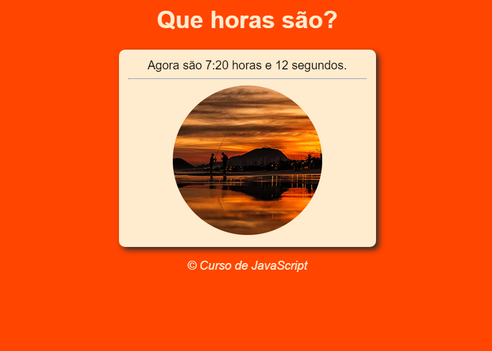
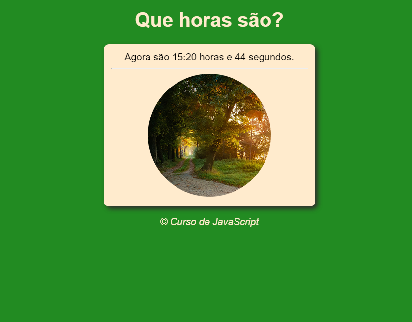
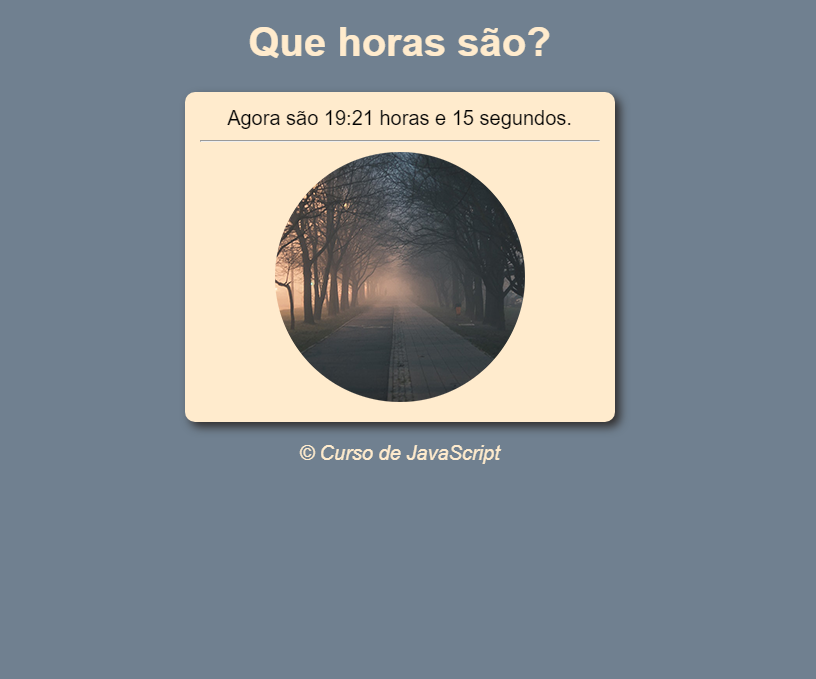

# JavaScript
Aqui eu vou postando meus estudos de JavaScript, sem nenhuma intenção, apenas aprender, saber o que é, como funciona, pra que serve? 

Nos "Project01" você verá o código desta página, alterando as cores e foto dependendo do horário atual.

  
